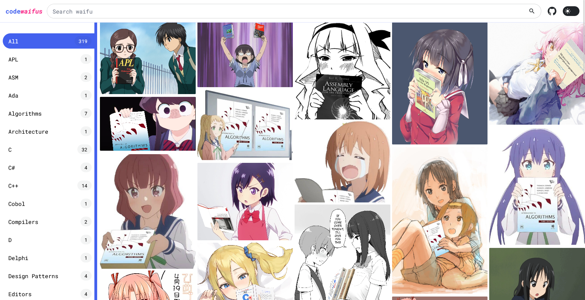

# Codewaifus

A website with various *anime* girls holding various *programming* books.

> Note: not finished yet.

---

This is a simple website made with [SvelteKit](https://kit.svelte.dev) 
and [Tailwindcss](https://tailwindcss.com) that implements a user interface 
for the [Anime Girls Holding Programming Books](https://github.com/cat-milk/Anime-Girls-Holding-Programming-Books) repository.

## Preview

